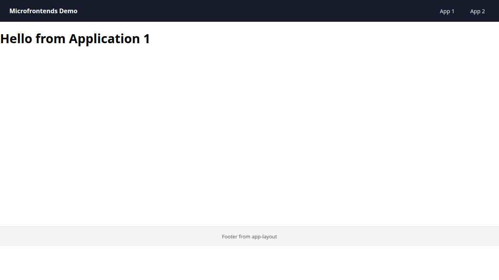
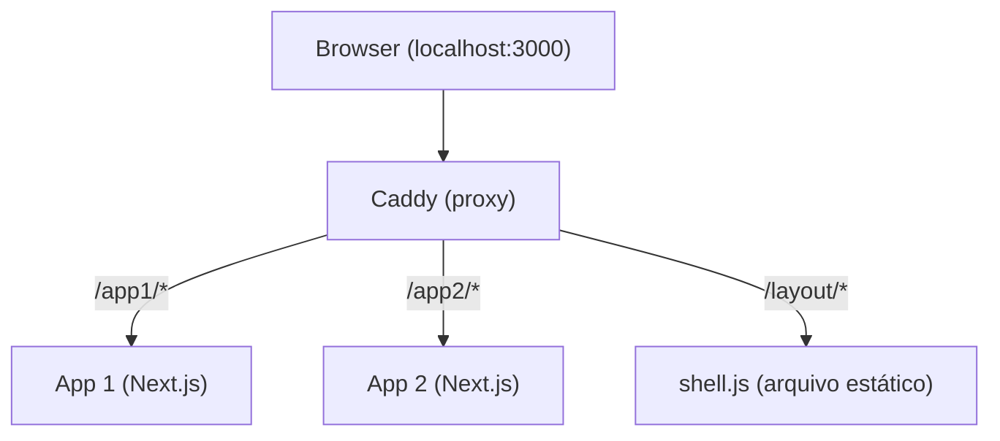

# Microfrontends Demo

Projeto demonstrativo da estratégia de microfrontends utilizada na Qive. Acompanha o artigo que descreve a arquitetura.



## Arquitetura



- **Proxy (Caddy):** roteia requisições por base path para a aplicação correta e serve o JavaScript do layout shell como arquivo estático.
- **App 1 e App 2:** aplicações Next.js independentes, cada uma com seu próprio `basePath`. Renderizam o conteúdo dentro de `#application-content`.
- **Layout Shell:** aplicação Vite + React compilada em um único `shell.js`. Monta topbar e footer em `#application-layout` e reposiciona `#application-content` dentro do seu layout.

Cada aplicação Next.js renderiza dois divs: `#application-layout` (alvo do layout shell — topbar e footer) e `#application-content` (conteúdo da aplicação). Antes de carregar o `shell.js`, cada aplicação define `window.__APP_LAYOUT` — um mecanismo que permite a cada microfrontend customizar o comportamento do layout shell (por exemplo, indicando quais elementos DOM usar como alvo).

## Pré-requisitos

- [Docker](https://docs.docker.com/get-docker/) e Docker Compose

## Como rodar

```bash
docker compose up -d --build --wait
```

Acesse [http://localhost:3000](http://localhost:3000).

Use os links "App 1" e "App 2" na topbar para navegar entre as aplicações. Topbar e footer são renderizados pelo layout shell e persistem entre as navegações.

## Como parar

```bash
docker compose down
```

## Estrutura do projeto

```
├── docker-compose.yaml
├── app1/                  # Next.js (Pages Router), basePath: /app1
│   ├── Dockerfile
│   ├── pages/
│   │   ├── _document.tsx
│   │   ├── _app.tsx
│   │   └── index.tsx
│   └── next.config.js
├── app2/                  # Next.js (Pages Router), basePath: /app2
│   ├── Dockerfile
│   ├── pages/
│   │   ├── _document.tsx
│   │   ├── _app.tsx
│   │   └── index.tsx
│   └── next.config.js
├── layout/                # Vite + React → shell.js
│   ├── src/
│   │   ├── main.tsx       # Lê window.__APP_LAYOUT, monta React root
│   │   ├── Layout.tsx     # Topbar + footer
│   │   └── global.d.ts    # Contrato: interface AppLayoutConfig
│   └── vite.config.ts
└── proxy/                 # Caddy + build do layout (multi-stage)
    ├── Dockerfile
    └── Caddyfile
```

## Contrato entre shell e aplicações

O único acoplamento entre o layout shell e as aplicações consumidoras é a variável global `window.__APP_LAYOUT`:

```typescript
interface AppLayoutConfig {
  getLayoutTarget: () => HTMLElement | null;
  getContentTarget: () => HTMLElement | null;
}
```

Cada microfrontend define essa variável antes do carregamento do `shell.js`, podendo customizar como o layout shell se comporta na sua página. Nesta demo o contrato é simples (apenas alvos DOM), mas em produção ele carrega configurações adicionais como flags de features e callbacks.
