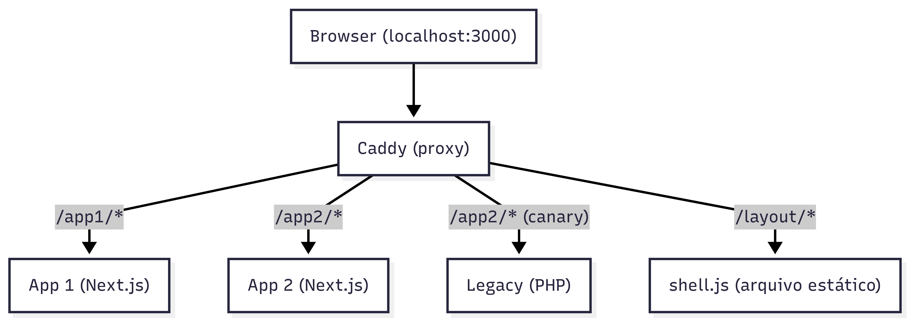
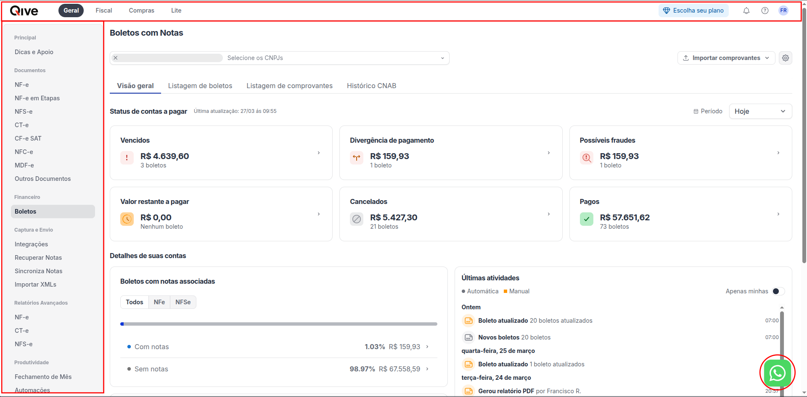

# Escalando o desenvolvimento frontend: Como usamos Micro Frontends aqui na Qive

> **TL;DR;** As ideias apresentadas nesse artigo estão demonstradas no projeto: [https://github.com/xico42/demo-microfrontends](https://github.com/xico42/demo-microfrontends)

Assim como na maioria das empresas, começamos nossa solução com um monólito.

Em dado momento, percebemos uma necessidade real e prática de quebrar esse monólito em partes menores: tanto por questão de viabilidade técnica, como para trazer mais autonomia para que diferentes times pudessem evoluir partes da nossa solução de forma autônoma.

Começamos esse processo pelo backend, isolando contextos mais fáceis de desacoplar em projetos independentes.

Entretanto, o frontend impõe um acoplamento intrínseco, que nos levou a postergar uma solução adequada. O usuário navega no produto e espera algum nível de padronização visual: cores, fontes, layout. A consistência é importante para manter uma UX minimamente aceitável.

Como, então, podemos escalar times de frontend, dando autonomia e *ownership*, mas ainda mantendo uma UX consistente?

Nesse artigo abordamos como a Qive tem adotado *Micro Frontends* para trazer autonomia e permitir escalar e evoluir novos produtos.

## O que é um Micro Frontend?

Essa arquitetura apareceu pela primeira vez no radar da *Thoughtworks* em 2016, de modo que existe material amplamente disponível sobre o tema.

Aqui o objetivo não é trazer mais um "repeteco" da discussão, mas sim contribuir com exemplos reais, te ajudar a entender quais as implicações práticas desse estilo, e em como implementar essa abordagem hoje.

Para citar o Cam Jackson, no [blog do Martin Fowler](https://martinfowler.com/articles/micro-frontends.html):

> "An architectural style where independently deliverable frontend applications are composed into a greater whole"

Ou em uma tradução livre:

> "Um estilo arquitetural no qual aplicações frontend, desenvolvidas e entregues de forma independente, são compostas para formar um todo maior."

Essa definição nos leva a fazer um paralelo muito claro com "Microsserviços". Entretanto, o frontend por si só impõe um nível de acoplamento que não está tão presente no *Backend*, e resulta em um desafio diferente.

Se pensarmos no contexto de uma aplicação WEB, o usuário final tem sua interação por meio do Browser e espera um mínimo de consistência visual. Por mais que uma aplicação esteja distribuída entre diversos *Micro Frontends*, ela precisa se apresentar visualmente consistente quanto a estética, cores, estilos, layout e forma.

Qualquer divergência quanto a esses parâmetros gera "estranheza" e impacta na experiência do usuário.

Portanto, para ser efetiva, uma implementação dessa arquitetura precisa resolver pelo menos 4 problemas:

1. Qual a granularidade dos *Micro Frontends*? Como quebrar a aplicação em partes menores?
2. Como garantir consistência visual entre os componentes? Botões, Cards, Inputs, Cores, etc.
3. Como manter consistência no layout da aplicação? Como podemos compartilhar aquilo que é comum e global? (ex: Topbar, Sidebar, Footer)
4. Como compor e integrar os *Micro Frontends* entre si, para formar o "todo maior"?

Como veremos a seguir, cada um desses problemas exige uma solução diferente e uma abordagem própria que precisam estar em sincronia.

## Implementando Micro Frontends na prática



Você pode acompanhar em um exemplo real como esses conceitos se aplicam no projeto de demonstração que acompanha esse artigo [aqui](https://github.com/xico42/demo-microfrontends).

Nele você encontra:

- Dois microfrontends em Next.js;
- Um microfrontend legado em PHP;
- Uma aplicação container que serve como a "cola" que conecta as diferentes aplicações em um layout comum;
- Um proxy-reverso responsável por orquestrar o acesso entre os frontends.

A única peça que não representamos nessa demonstração, por questões de simplicidade, foi o "Design System".

### Defina a granularidade dos Micro Frontends

Este é o cerne da arquitetura, e é o que vai direcionar as próximas decisões.

Aqui na Qive, nosso ecossistema é dividido em pequenos produtos. Muitas vezes cada um sendo composto por uma ou diversas páginas relacionadas. Dessa forma, o racional é evidente: dividimos nossos microfrontends por vertentes de negócio ou domínios.

O ponto principal para essa decisão é garantir independência ponta-a-ponta: Um mesmo time cuida do frontend e backend até a camada de dados.

Além disso, existe um fator técnico que nos impulsiona nessa direção: Páginas independentes são mais fáceis de orquestrar, do que manter diversos microfrontends dentro de uma única página. No nosso caso, a orquestração dos microfrontends é feita diretamente na camada do proxy-reverso.

### Mantenha consistência visual com um Design System

A consistência visual em uma aplicação WEB é importante, e esse desafio é ainda maior quando diferentes times trabalham de forma independente em frontends desacoplados entre si.

Nesse cenário, se torna essencial uma biblioteca de componentes que comunique os princípios de Design do seu produto. O foco deve ser nos "building blocks" que potencializam os times a terem autonomia.

### A cola de tudo: Um layout compartilhado



Praticamente toda aplicação WEB contém elementos compartilhados como Topbar, Sidebar, Notificações e Alertas ou Chat de atendimento ao cliente.

Inclusive, essa camada pode ainda estar diretamente associada a um controle de acesso mais fino, com regras de negócio próprias.

Por isso, nesse ponto optamos por tratar o Layout como uma aplicação independente. Build, deploy e backend próprios.

Na abordagem que propomos, o Layout é uma aplicação client-side que envolve o conteúdo principal sendo apresentado. Essa estratégia nos permitiu evoluir nosso frontend garantindo consistência.

O interessante dessa estratégia é que do monolito legado às novas aplicações, todas compartilham o mesmo layout de forma bem transparente para os consumidores.

```javascript
// Arquivo no projeto de demonstração: app1/pages/_document.tsx

// Container do layout
<div id="application-layout" />
// Container da aplicação
<Main />  
// Carregamento do Layout
<Script src="/layout/shell.js" type="module" strategy="afterInteractive" />
```

Perceba: nessa estratégia o layout se configura ao redor do
conteúdo. Ele não é o responsável por agregar os diversos
outros microfrontends. É uma aplicação independente,
importada pelos microfrontends "clientes". O que difere
bastante de outras abordagens ([exemplo aqui](https://martinfowler.com/articles/micro-frontends.html#TheContainer)).

A principal vantagem é que se torna muito fácil adaptar
qualquer projeto para utilizar um layout em comum, desde
uma aplicação legada em PHP a serviços mais recentes
baseados em NextJS.

É exatamente o que buscamos demonstrar no projeto de
demonstração:

```php
// index.php
<!DOCTYPE html>
<html>
<head>
    <style>
        body { margin: 0; }
        #application-content { display: none; }
    </style>
</head>
<body>
    <div id="application-layout"></div>
    <div id="application-content">
        <h1>Legacy codebase</h1>
    </div>
    <script>
        window.__APP_LAYOUT = {
            getLayoutTarget: function() {
                return document.getElementById('application-layout');
            },
            getContentTarget: function() {
                return document.getElementById('application-content');
            },
        };
    </script>
    <script src="/layout/shell.js" type="module"></script>
</body>
</html>
```

### A orquestração: Um proxy inteligente

Uma camada de orquestração é essencial para manter a coesão: autenticação, autorização, roteamento para o serviço adequado, mantendo o usuário dentro do mesmo domínio.

No projeto de demonstração, utilizamos o caddy:

```
@app1 path /app1 /app1/*
handle @app1 {
  reverse_proxy app1:3000
}

@app2 path /app2 /app2/*
handle @app2 {
  reverse_proxy app2:3000
}
```

Você talvez esteja se perguntando: mas por que caddy e não nginx?

Nosso proxy não é responsável apenas por roteamento, também centralizamos a primeira camada de autorização e autenticação, além de termos diversos *plugins* de auditoria, compliance e métricas.

Também é onde orquestramos o estrangulamento do monolito, rollouts parciais e testes A/B.

O Caddy nos permite ter um total controle sobre a camada de borda da nossa aplicação, mantendo performance, resiliência e [extensibilidade utilizando Go](https://caddyserver.com/docs/extending-caddy).

Praticamente todo aspecto do caddy pode ser estendido simplesmente
implementando [uma interface Go](https://caddyserver.com/docs/modules):
client http, drivers de armazenamento para servidor de arquivos estáticos,
middlewares http, etc.

Aqui na Qive implementamos diversos plugins para o caddy, adaptando
essa camada de proxy para nossa realidade, com regras de auditoria,
caching, telemetria, autorização e até mesmo feature flags.

A extensibilidade do Caddy caiu como uma luva, principalmente por conta
da nossa expertise em Go. No pacote `main` é necessário apenas importar
os módulos customizados e com um único `go build` já temos
uma camada de proxy flexível:

```golang
package main

import (
	caddycmd "github.com/caddyserver/caddy/v2/cmd"

	_ "github.com/caddyserver/caddy/v2/modules/standard"
	_ "github.com/example/microfrontends-demo/proxy/src/canary"
)

func main() {
	caddycmd.Main()
}
```

No projeto de demonstração que acompanha esse artigo implementamos
um plugin que simula um "canary rollout" entre um frontend Next.js e
uma aplicação legada em PHP.

Aqui na Qive, normalmente fazemos isso por meio de feature flags
e o OPA (Open Policy Agent), mas sempre orquestrado pela nossa camada
de proxy inteligente!

## Conclusão

A arquitetura de Micro Frontends impõe desafios técnicos que precisam ser avaliados contra a realidade de cada empresa. Entretanto, é o que tem viabilizado escalar a engenharia e dar autonomia para os times aqui na Qive.

Nossa solução chegou a essa estrutura no final de 2024. De lá
para cá a adoção dessa arquitetura tem sido natural, e hoje temos
algumas dezenas de microfrontends que juntos têm ajudado empresas a
redefinir o Contas a Pagar.

Ficou interessado nas soluções que construímos? Se você é uma pessoa engenheira que se entusiasma com a ideia de resolver desafios complexos com ferramentas modernas e em um ambiente que preza pela excelência técnica e produtividade, você se sentiria em casa aqui.

**Estamos contratando**! Dê uma olhada em nossas vagas abertas e venha construir o futuro com a gente: [https://qive.com.br/carreiras/](https://qive.com.br/carreiras/)

Obrigado pela leitura e até a próxima!

## Referências

- [https://martinfowler.com/articles/micro-frontends.html](https://martinfowler.com/articles/micro-frontends.html)
- [https://caddyserver.com](https://caddyserver.com)
- [https://github.com/xico42/demo-microfrontends](https://github.com/xico42/demo-microfrontends)
